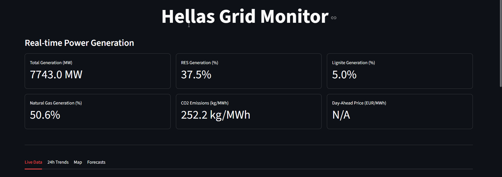
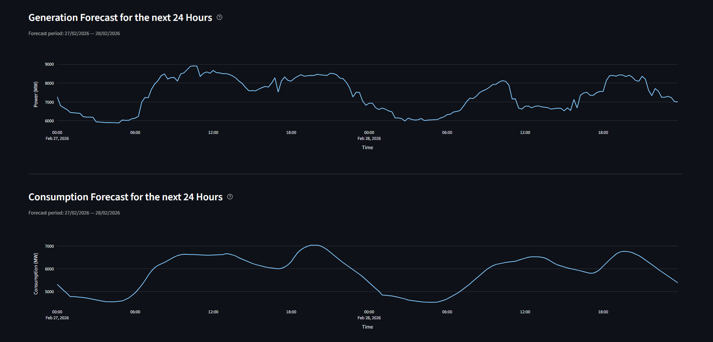
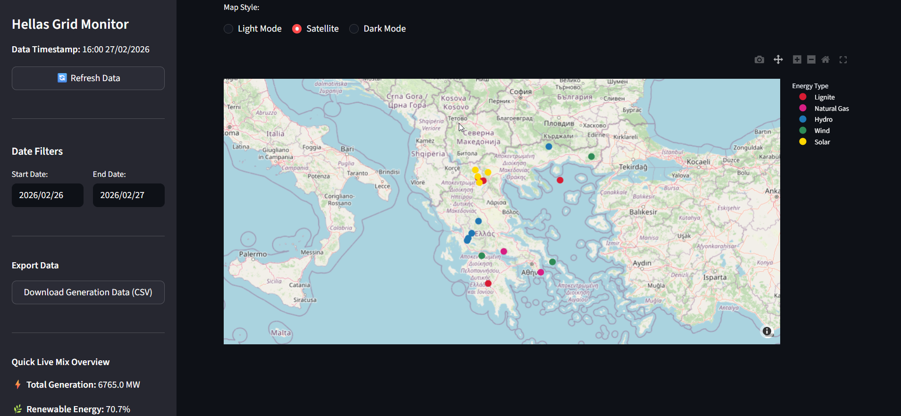

# **Hellas-Grid-Monitor**

**Hellas Grid Monitor** is a specialized data analytics and visualization software developed to track, analyze, and forecast the behavior of the Greek national electricity grid. It solves the problem of energy data fragmentation by aggregating real-time generation, consumption, Day-Ahead pricing, and meteorological data into a single, state-of-the-art, interactive dashboard. It gives anyone (from energy professionals to curious citizens) a clear-live view of how Greece produces and consumes electricity. The dashboard includes much information and covers everything from the current energy mix to day-ahead market prices.

Designed for analytical transparency, the application processes live data from the **ENTSO-E Transparency Platform** and correlates it with localized weather conditions via the **OpenWeatherMap API**, adhering to standard energy monitoring principles.


-----
-----


## Key Features & Functionality
The software is divided into interactive modules, offering both real-time monitoring and historical analysis:
* **Live Grid Overview:** Dynamically retrieves, processes, and visualizes the most recent available generation snapshot from the ENTSO-E API as an interactive Plotly pie chart. The current energy mix is broken down by individual source (Lignite, Natural Gas, Hydro Water Reservoir, Hydro Run-of-River, Wind Onshore, Solar, Biomass, Geothermal). Renewable sources are aggregated to compute a live RES (Renewable Energy Sources) percentage, which drives a gauge indicator that dynamically colors the grid's status (green > 50%, orange > 20%, red < 20%).
* **Carbon Footprint Tracking:** Computes a real-time carbon intensity index (kg CO₂/MWh) by applying standard emission factors to the live output of thermal power plants — 1,000 kg/MWh for Lignite and 400 kg/MWh for Natural Gas. The resulting value represents the weighted average carbon cost of each MWh currently being produced on the Greek grid, displayed both as a KPI metric on the main dashboard and as a normalized progress indicator in the sidebar.
* **Market & Load Trends (24h):** Provides a comprehensive time-series analysis over a user-defined date range. Generation evolution per source is rendered as a stacked area chart, allowing visual identification of dispatch patterns and renewable penetration windows. The system load (demand curve) is plotted separately as a line chart, with automatic detection and display of peak and off-peak consumption timestamps. Day-Ahead wholesale market prices (EUR/MWh), sourced directly from ENTSO-E, are charted with min/max price timestamps.
* **Interactive Energy Map:** Geographically maps major Greek power generation assets across all energy types (Lignite, Natural Gas, Hydro, Wind, Solar). For each plant, the map displays the operator, maximum capacity (MW), and a short description. The OpenWeatherMap API is queried in real time at each plant's precise GPS coordinates, retrieving live temperature, wind speed, and cloud cover. Based on these parameters, the application automatically evaluates and labels the operational status of each renewable asset (e.g., "High Wind Output", "Low Solar Output (Cloudy)"). The map supports three rendering styles: Light Mode, Dark Mode, and Satellite.
* **System Forecasting:** Retrieves and visualizes ENTSO-E's official 24-hour ahead predictive models for both total power generation and total system consumption. Forecasts are shown as interactive line charts covering the current and following day, providing a forward-looking view of expected generation capacity and demand levels.
* **Quick Live Mix Overview:** A sidebar snapshot that displays the current grid status at a glance, without navigating to any tab. Shows total active generation (MW) alongside four normalized progress bars for Renewable Energy share, CO₂ Emissions intensity, Lignite share, and Natural Gas share. The data is derived from the latest available data timestamp.
* **Data Export:** Enables users to extract generation data for any selected time window into a CSV file. The export is fully compatible with Microsoft Excel, and includes a labeled datetime index. The file is named dynamically based on the selected date range (e.g., `Hellas_Grid_2025-03-01_to_2025-03-04.csv`).


-----


## Data Sources & APIs
The dashboard relies on two primary external data streams, both processed via dedicated Python functions with defensive error handling in case of API unavailability:
* **ENTSO-E Transparency Platform:** The primary data source of the application. All grid data is retrieved via the official ENTSO-E Transparency Platform, which is the authoritative source for European electricity market and grid data. Through this API, the application gains access to real-time and historical power generation per source, total system consumption, Day-Ahead Market wholesale prices, and 24-hour ahead forecasts for both generation and load. All data is scoped to the Greek bidding zone using Greece's official EIC area code ("10YGR-HTSO-----Y"). Data is automatically cached and refreshed every 15 minutes in order not to overload the API. To use this API, a free account and personal API token are required. Registration is available at [transparency.entsoe.eu](https://transparency.entsoe.eu).
* **OpenWeatherMap API:** Provides real-time meteorological data for each of the mapped power plants, queried individually by their precise geographic coordinates. Through this API, the application retrieves live temperature, wind speed, and cloud cover at each plant's location. This data is then used to automatically evaluate and display the operational status of renewable assets — for example, determining whether a wind farm is likely producing at full capacity or whether a solar park is being affected by heavy cloud cover. To use this API, a free account and personal API token are required. Registration is available at [openweathermap.org](https://openweathermap.org/api).


-----


## Mathematical Logic
The application does not just display raw data. It is based in formulas to derive its real-time insights.
### 1) Energy Mix & Renewable Penetration
To determine the grid's reliance on specific fuel types, the application isolates the active power ($P$) of targeted sources and calculates their share against the total system generation.
* **Renewable Energy Share (RES):** Aggregates the real-time active power output ($MW$) of Wind Onshore, Solar, Hydro Water Reservoir, and Biomass.

$$\text{RES}_{\text{\%}} = \left( \frac{\sum P_{\text{RES}}}{P_{\text{total}}} \right) \cdot 100$$

* **Fossil Fuel Share:** Calculated individually to monitor the reliance on highly polluting sources.

$$\text{Lignite}_{\text{\%}} = \left( \frac{P_{\text{lignite}}}{P_{\text{total}}} \right) \cdot 100$$

### 2) Carbon Footprint Estimation
The tool calculates a real-time estimation of the grid's carbon intensity. This calculation is based on standard emission factors assigned to the primary fossil fuels utilized in the Greek power grid: 1000 kg/MWh for Lignite and 400 kg/MWh for Natural Gas.

$$\text{CO}_{2} \text{ Intensity (kg/MWh)} = \frac{(P_{\text{lignite}} \cdot 1000) + (P_{\text{gas}} \cdot 400)}{P_{\text{total}}}$$

### 3) Meteorological Evaluation Logic
The application estimates the current operational status of wind and solar plants by applying simple rules to live weather data fetched from the OpenWeatherMap API.
* **Solar Power Evaluation:** Evaluated via Cloud Cover percentage ($CCP$).
  * If $CCP > 80\% \rightarrow$ **Low Solar Output (Cloudy)**
  * If $50\% < CCP \le 80\% \rightarrow$ **Moderate Solar Output (Partly Cloudy)**
  * If $CCP \le 50\% \rightarrow$ **High Solar Output (Clear)**
* **Wind Power Evaluation:** Evaluated via Wind Speed ($v$) in meters per second ($m/s$).
  * If $v < 3 \text{ m/s} \rightarrow$ **Low Wind Output (Calm)**
  * If $3 \le v < 8 \text{ m/s} \rightarrow$ **Moderate Wind Output**
  * If $v \ge 8 \text{ m/s} \rightarrow$ **High Wind Output (Windy)**


-----


## Interface Preview
### **1) Real-Time Grid Analysis**
The main interface categorizes power by source.



### **2) Market & Load Forecasting**
This section visualizes generation and consumption forecasts.



### **3) Greece Energy Map**
The **Greece Energy Map** integrates geographical data with live meteorological insights for plants. Hovering over assets displays useful information.




-----


## Software
Hellas Grid Monitor is a web-based data dashboard built entirely in Python, accessible through any modern browser without requiring any additional installation beyond the listed dependencies.
* **Language:** ***Python 3.x***
* **GUI Framework:** ***Streamlit***
* **Data Processing:** ***Pandas***
* **Data Visualization:** ***Plotly (Express & Graph Objects)***
* **API Integration:** ***entsoe-py, Requests***


-----


## Libraries & Frameworks
| Package | Purpose |
|---------|---------|
| `streamlit` | Web dashboard framework |
| `pandas` | Data processing and analysis |
| `plotly` | Interactive charts and visualizations |
| `entsoe-py` | ENTSO-E API client |
| `requests` | OpenWeatherMap API calls |


-----


## Installation Guide
### Requirements
- Python 3.8+
- Active ENTSO-E API token
- Active OpenWeatherMap API token
### Setup
In your IDE's terminal please enter the following:
```bash
pip install streamlit pandas plotly entsoe-py requests    # To install all the required libraries
python -m streamlit run hellas_grid_monitor.py    # To run the program
```
### API Key Configuration
When you open `hellas_grid_monitor.py` replace the following placeholder tokens with your own personal API keys:
```bash
ENTSOE_token = "YOUR ENTSO-E API KEY"
OWM_token = "YOUR OpenWeatherMap KEY"
```


-----


## Technical Limitations
While the application provides robust real-time analytics, it operates under the following engineering assumptions and data constraints:
* **Data Availability:** The dashboard relies entirely on live data from ENTSO-E and OpenWeatherMap. If their servers experience downtime or reporting delays, the application will temporarily show missing data.
* **Simplified Meteorological Logic:** The renewable status evaluation (Wind & Solar) is based on simplified weather system and serves as a high-level estimate only. It does not account for detailed variables specific to each asset, such as the exact wind speed a turbine needs to start generating power, or how extreme heat reduces solar panel efficiency, or the impact of panel tilt and orientation on photovoltaic panels.
* **Incomplete Pricing Data:** Occasionally, the Day-Ahead prices might be unavailable for specific dates due to missing data in the ENTSO-E database. The application catches these errors gracefully and will simply display a null value instead of crashing.


-----


## License
MIT License: Free to use, modify, and distribute with attribution.


-----
-----


## **Developer**
**Dimitrios Poulos** <br>
*Electrical \& Computer Engineering Student*
* **Release Date:** February 2026
